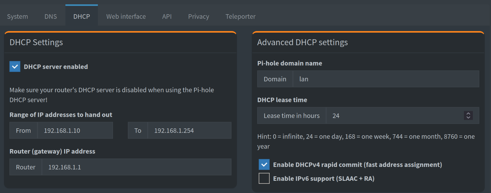
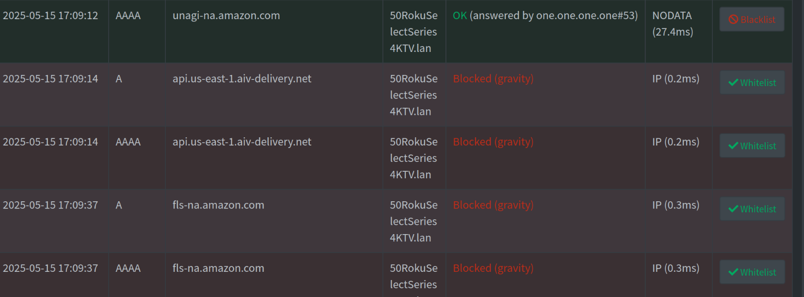

# About

For this project, I set up Pi-hole as a DNS server to block ads, trackers, and malicious domains across my entire network. This gave me greater visibility into the traffic on my network and helped me detect any suspicious behavior. I also configured Pi-hole to act as the DHCP server, which allows me to easily identify which devices are making specific DNS requests.

To securely access my network from outside, I set up PiVPN using WireGuard. This lets me connect to my home network remotely, whether I'm on public Wi-Fi or traveling, and ensures all my traffic is encrypted. It also makes it easy to manage services like the Minecraft server I have running at home.

# Pi-hole Dashboard

# Local DNS Records
With local DNS records I can access my switch, minecraft server, and raspberry pi via their domain name so I don't have to type in the IP address every time. 

# DHCP Settings
I chose to make Pi-hole the DHCP server instead of just pointing my router’s DNS settings to Pi-hole because, in that setup, all DNS requests appeared to come from the router. By letting Pi-hole handle DHCP, I can see the actual device names and IP addresses making each request, which gives me much better visibility and granularity when monitoring network activity.

# Example Query



