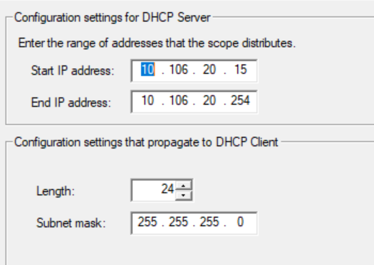
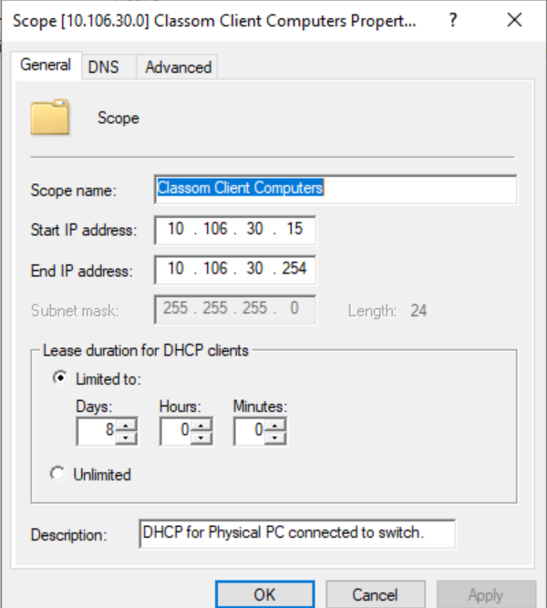
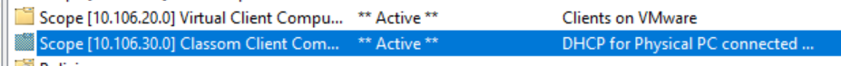
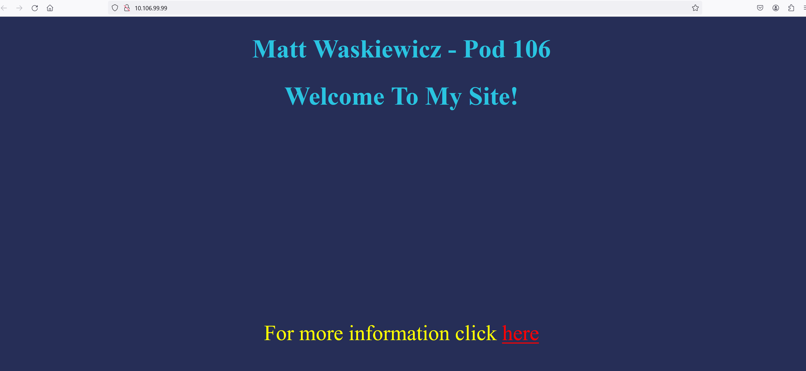
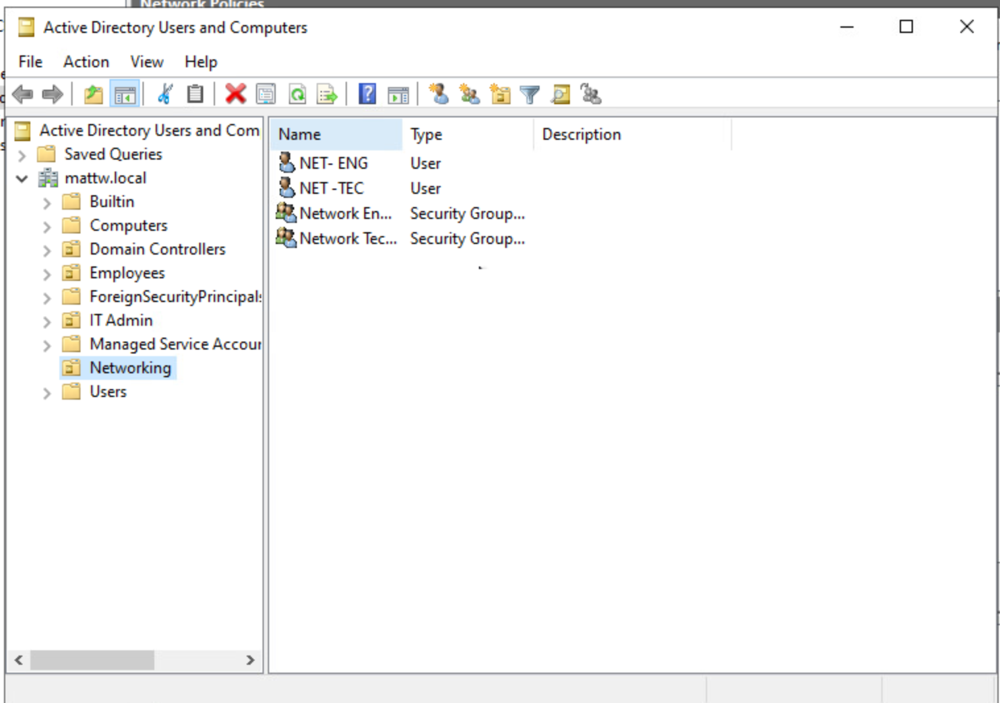

---                                                                         
name: VMWare Capstone Project                                   
tools: [Active Directory, Virtualization, Networking]
image: ../images/vmware.jpg
description: Some documentation I did on my cyber capstone project at SCCC.
---

## About
This page demonstrates the capstone project I did at SCCC where I created a simulated network using VMware Esxi and cisco switches and routers.

## Topology
In the network we had 2 Domain controllers, 1 windows 10 client, 1 web server, and 1 nagios server running on vmware. For the physical connection we had a layer 3 cisco switch.


## DHCP
We created a DHCP server on DC1. We created network scopes for the classroom and virtual VLANS. With DHCP we no longer had to manually set our IP each time we used the network. 

Range for Virtual Computers

Range for Classroom Computers

DHCP Scopes

## VLANS
We created several VLANS including, a DMZ zone, Parking Lot, cisco devices, virtual clients, physical clients, and managment network/servers. Each vlan is created as a separate interface on the switch. The ip-helper-address is applied to each interface so they can receive IP addresses from the DHCP server.


```
interface Vlan1
 ip address 10.106.0.1 255.255.255.0
 ip helper-address 10.106.30.3
!
interface Vlan10
 ip address 10.106.10.1 255.255.255.0
 ip helper-address 10.106.30.3
!
interface Vlan20
 ip address 10.106.20.1 255.255.255.0
 ip helper-address 10.106.30.3
!
interface Vlan30
 ip address 10.106.30.1 255.255.255.0
!
interface Vlan40
 ip address 10.106.40.1 255.255.255.0
 ip helper-address 10.106.0.3
!
interface Vlan99
 ip address 10.106.99.1 255.255.255.0
!
```
## Webserver
Inside the Demilitarized Zone(DMZ) we all created a web server. This is a super basic web server I made that had a file that once downloaded would spam a pop up on windows. 

When someone clicks "here" it downloads a file. When the file is ran it spams a windows popup until the user kills the script in task manager. 


## Setting up RADIUS
We set up Remote Authentication Dial In User Service(RADIUS) on the Cisco switch. We then utilized the network Policy Server in Active Directory. We created two users in the Networking OU to represent an IT department. The first one is a Network Engineer and the second is a Network Technician. I used [this](https://www.ciscozine.com/manage-cisco-with-nps-radius/) tutorial to assist in setting up radiusWe set up Remote Authentication Dial In User Service(RADIUS) on the Cisco switch. We gave read permissions to the Net-tec group and full permissions to the net-eng group





