# Getting onto the network

For this LAB I simulated an internal attacker. I connected my kali box to the network and got an IP address via DHCP.
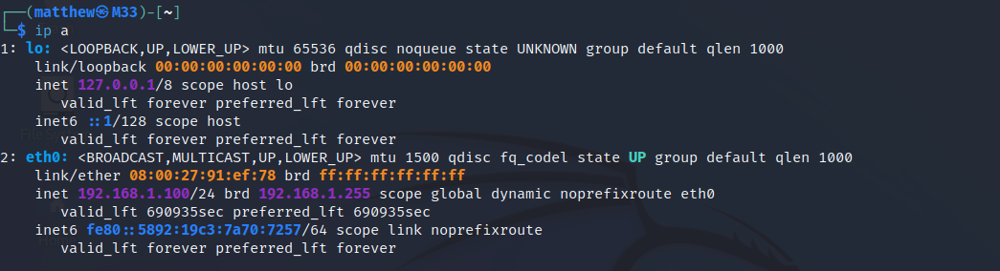

After getting connected to the network, I started my reconnaissance with an nmap ping sweep of the network.


As seen in the image above, there are 3 servers and 1 windows client.

## LLMNR/NetBios Poisoining 
I started my attack with responder. Responder is a relatively passive tool that abuses LLMNR/Netbios to listen for failed connections and get the hash for that user.
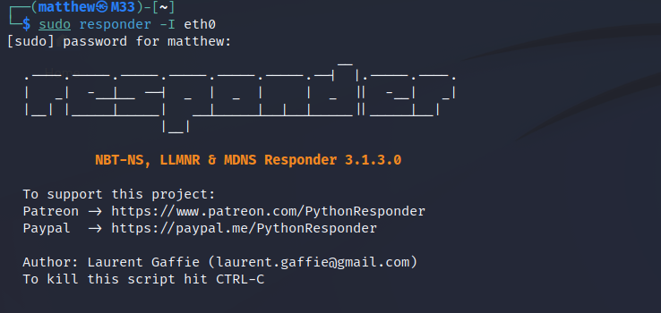

I then simulated a user visiting a share on the network


Responder was able to capture this hash and I used hashcat to crack it.
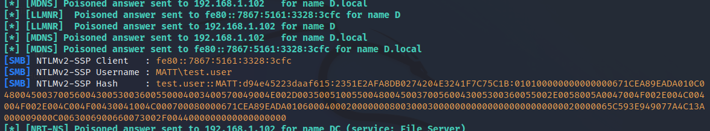

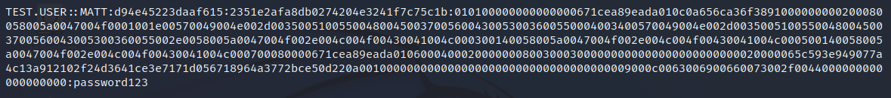

# Enumerating with credentials

I used NetExec to enumerate the Domain Controller via SMB. I started by listing shares test.user has access to. The user only has access to Sales because it is a member of Sales.


I used NetExec to list Domain users and then output the users to a file.


# Enumerating Service Principal Names (Kerberoasting)

I utilized the list of users and the test.user credentials to find any users with a SPN set. I was able to find the backupservice account is kerberoastable. After getting the hash I was able to crack and get the password for the backupservice user.
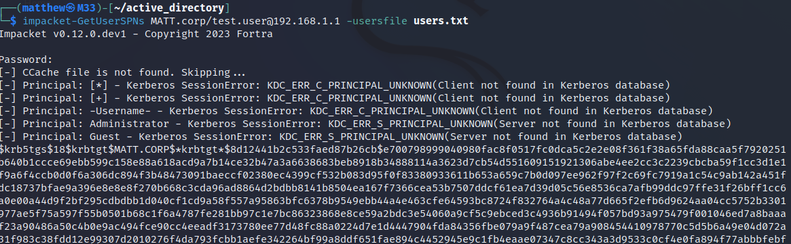
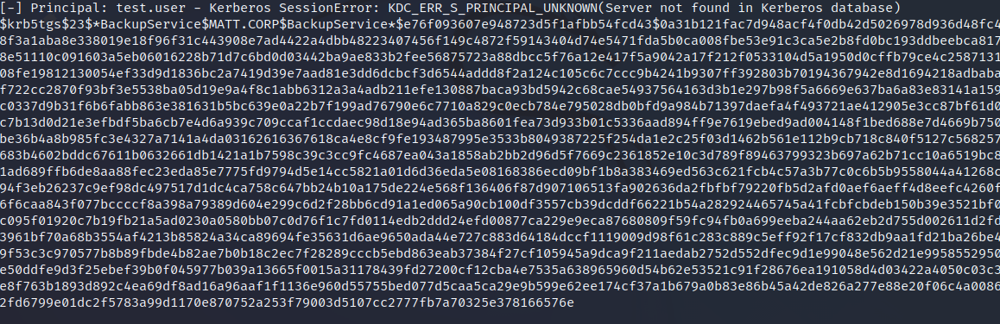
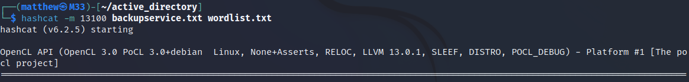


# Enumerating for AS-REP Roasting

I also disabled Kerberos preauthentication on an account to perform an AS-REP roasting attack. After getting the hash I was able to crack the password for paule.raune

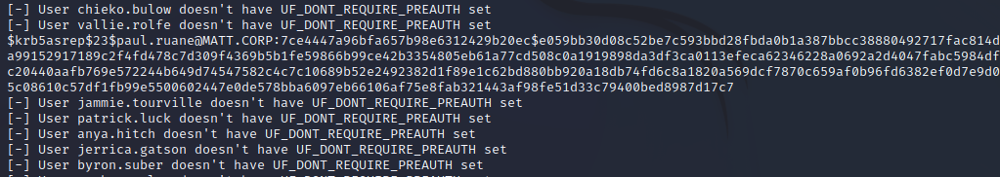

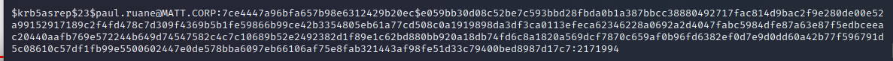

# Escalating Privileges to Domain Admin.

I checked what shares the Backup Service user had access to.


Since the user has access to the IT group I can assume it is a member of that group. I used this command to verify it.


I also used the backupservice account to check the members of the domain admins group. Looking at the output I noticed j.robinson who is a member of the IT group is also a member of domain admins.
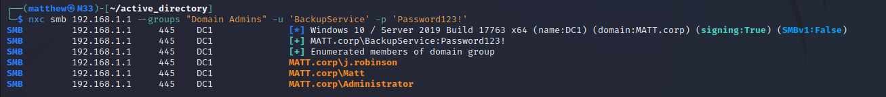

I decided to check out the IT share to see if I could find anymore information. Looking at the share there is a file called passwords.txt with a list of passwords. I used this list to perform a password spray with the previously found users.

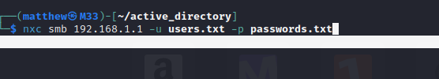

Looking at the output I got a sucessful password combination `j.robinson:jd,2<n31di9`


# Getting All Users passwords
After getting Domain administrator credentials I used RDP to connect to the Certificate server.


Once connected I uploaded mimikatz and ran the following commands to get the hash of every user in the domain. I used log within mimikatz to get a file containing the output

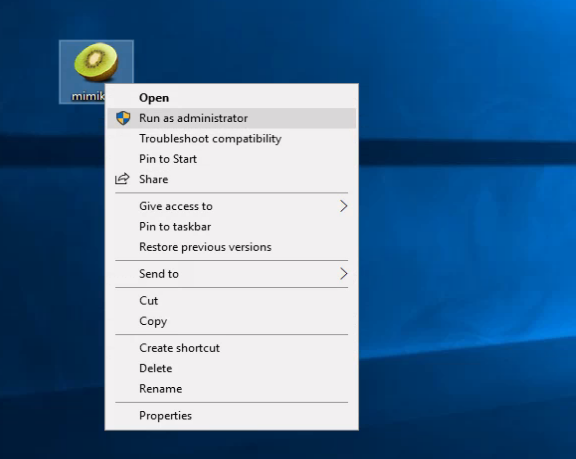
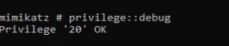
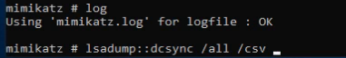
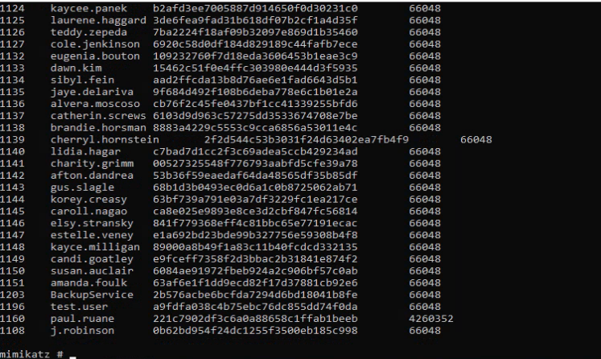

After obtaining all the hashes and transferring them to my attacker machine via SMB, I used hashcat to bruteforce all of them.


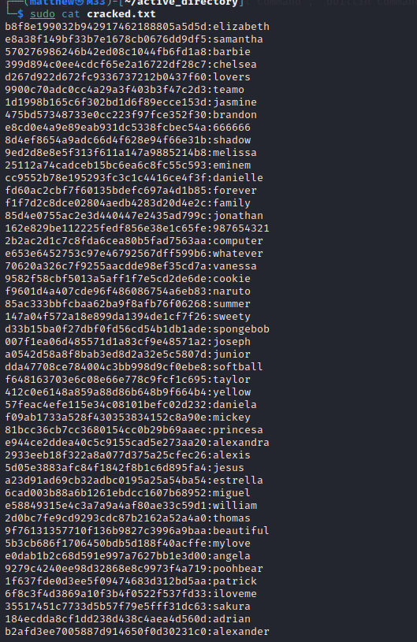

Lastly, I used a python script to take each hash and password combination and match it to a username from the mimikatz log.
```python
# Load hash:password pair into a dictionary.
hash_to_password = {}
with open('cracked.txt', 'r') as hashpass:
    for line in hashpass:
        parts = line.strip().split(':', 1)
        if len(parts) == 2:
            hash_val, password = parts
            hash_to_password[hash_val.strip()] = password.strip()

# Process the user and hash from the mimikatz.log and output to a file with a user:pass pair
with open('mimikatz.log', 'r') as mimi, open('matched_output.txt', 'w') as output_file:
    for line in mimi:
        parts = line.strip().split('\t')
        if len(parts) >= 3:
            username = parts[1].strip()
            hash_val = parts[2].strip()
            password = hash_to_password.get(hash_val)
            if password:
                output_file.write(f"{username}:{password}\n")
```
Output:




