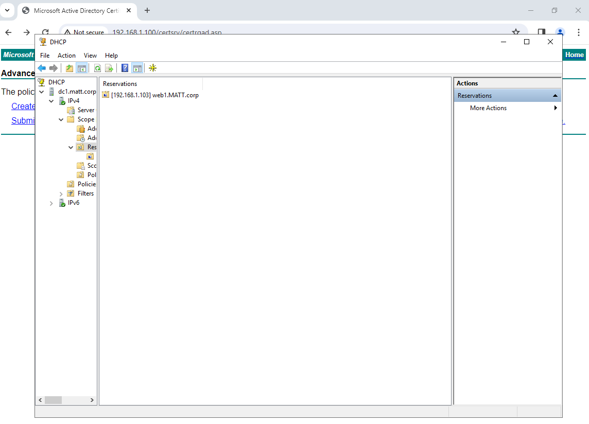
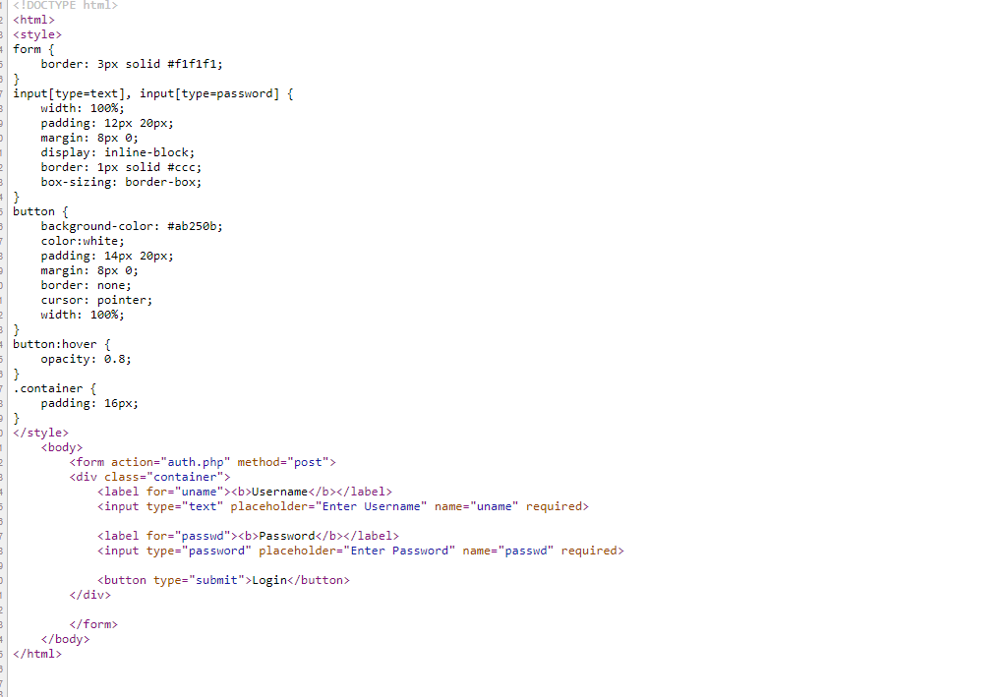
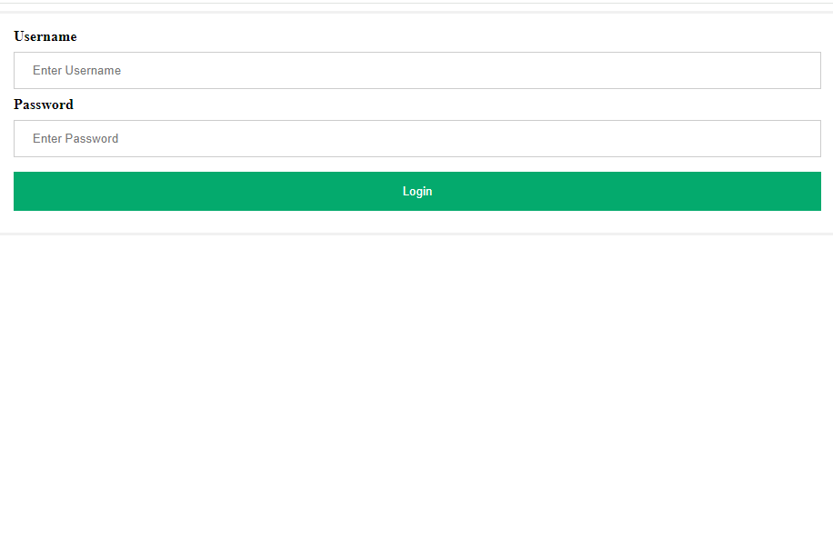
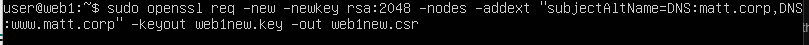
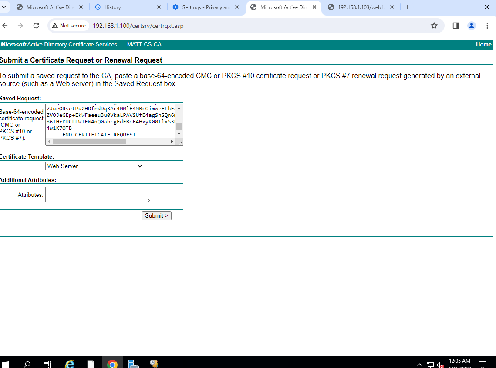
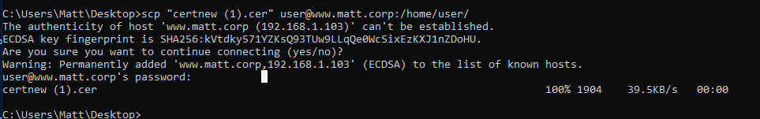
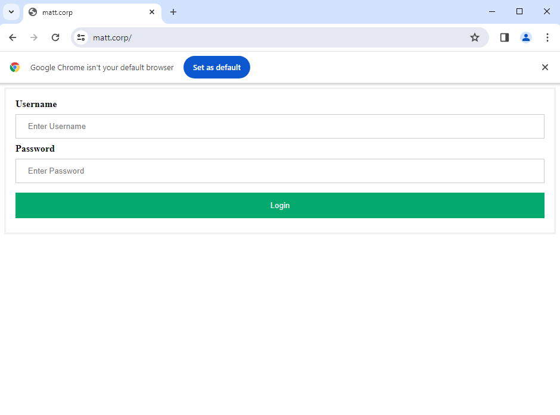
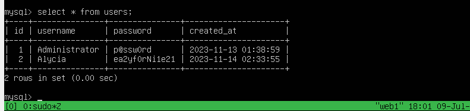
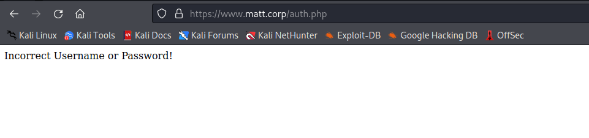

# Configuring the Web Server

For the web server I used Ubuntu server 22.04. 

## Getting access to the domain
I wanted to learn how to set up DHCP reservations in Active Directory, so I set up a DHCP reservation for the web server. Although statically assigned addresses are generally preferred for servers in most networks, I wanted practice making DHCP reservations. One challenge I encountered was that the web server was not receiving the correct address. After doing some research, I discovered that I had to modify the /etc/netplan/file.yaml in order to receive the correct MAC address and gain access to the domain.

Next I created a DHCP reservation on the domain controller. 

# Front End
After getting attached to the network, I began setting up the web server. I used a LAMP stack to create the web server. I used Apache as my web host, Mysql for the backend database, and PHP as the intermediary language. 
This is the source code of the index.php page. I used this [website]( https://www.w3schools.com/howto/tryit.asp?filename=tryhow_css_login_form) to help with the html and css. After setting up the front end, I moved on to creating a SSL Certificate

What the front end originally looked like

# SSL Certificate
Next I focused on adding an SSL certicate to the web server. As you probably know, HTTP is an insecure protocol that sends all data without any encryption. This is why I used an Active Directory Certifcate Server to create a trusted certifcate for my web server. 

The first step in geting my certifcate was to create a request using openssl on the web server.


***

ABSTRACT: Something very important to note about this request is the SubjectAltName portion. When I first created the certificate and attempted to use it on chrome, it was still appearing as insecure. It took me a while to figure out what was causing this issue. Afer doing some research online I found this [post](https://stackoverflow.com/questions/67184724/why-ssl-certificate-only-works-in-internet-explorer) . I then recreated the certificate with the SubjectAltName and went through the process again, and no longer received the error.

***

After creating the request on Ubuntu, and transferring the file to the Windows DC1. I visited the Certificate Server web page(DC2) 

I then got the certificate, added it to the group policy as a trusted cert, and transferred it back to the ubuntu server


After getting the certificate on ubuntu I ran the following commands. 
```bash
sudo cp "certnew (1).cer" /etc/ssl/certs/web1new.crt
sudo cp web1new.key /etc/ssl/private/
```

***

ABSTRACT:Originally, I modified the default-ssl.conf file and added the certifcatefile path and certificate file path key there. This allowed me to access the website via HTTPS, however, there was no redirect when visiting from HTTP.

***

# HTTP Redirect
I created a new file in the /etc/apache2/sites-available directory named "192.168.1.103.conf". I created this file so that when visiting the HTTP version of the site, you would be redirected to the HTTPS version. 

Lastly, to apply these changes I ran the following commands
```bash
sudo a2ensite 192.168.1.103.conf
sudo systemctl reload apache2
```
Now when you access the site you will be redirected to the sercure version with no certificate warning.


*** 

# Backend
For the backend, I created a database named Users with a table called users. Here is a selection of the data in the database. 

This is the original authentication code used to connect the database to the front end. As you may have noticed, the code is vulnerable to SQL injection. 
```php
<?php

session_start();

if ($_SERVER['REQUEST_METHOD'] === 'GET') {
	//Deny access to authenitcation page
	http_response_code(403);
	die();
	header('HTTP/1.1 403 Forbidden');

}
$servername = "localhost";
$username = "Administrator";
$password = "p@ssw0rd";
$dbname = "users";

//create connection
$conn = new mysqli($servername, $username, $password, $dbname);

if ($conn->connect_error) {
	die("Connection Failed: " . $conn->connect_error);
}

//retrieve values from html form
$entered_user = $_POST['uname'];
$entered_pass = $_POST['passwd'];

//query database
$sql = "SELECT * FROM users WHERE username='$entered_user' AND password='$entered_pass'";
$result = mysqli_query($conn, $sql);
$row = mysqli_fetch_array($result, MYSQLI_ASSOC);
$count = mysqli_num_rows($result);

if($count == 1){
	$_SESSION['username'] = $row['username'];
	header("Location: creds.php");
} else {
	echo "Incorrect Username or Password!";
}
?>
```

If the user enters the correct credentials, the website will forward them to this page. 


If a user enters the wrong credentials, they receive this message. 





