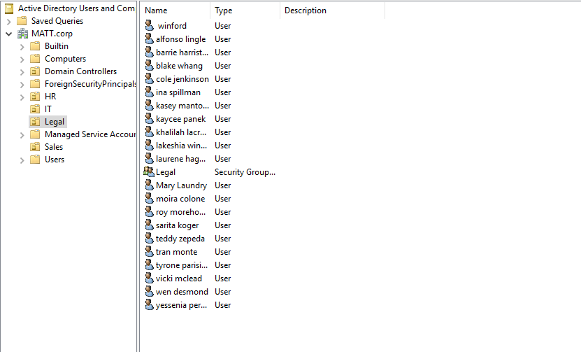
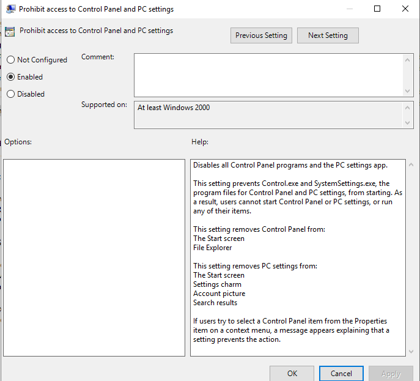
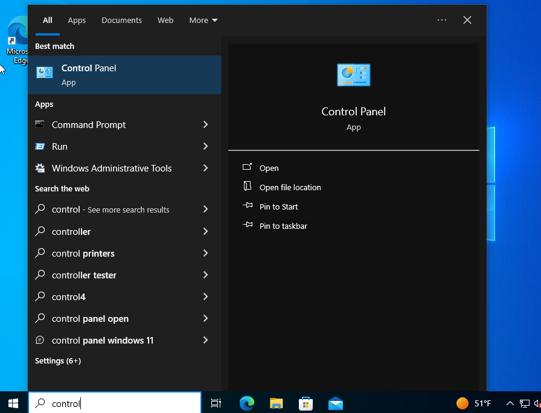
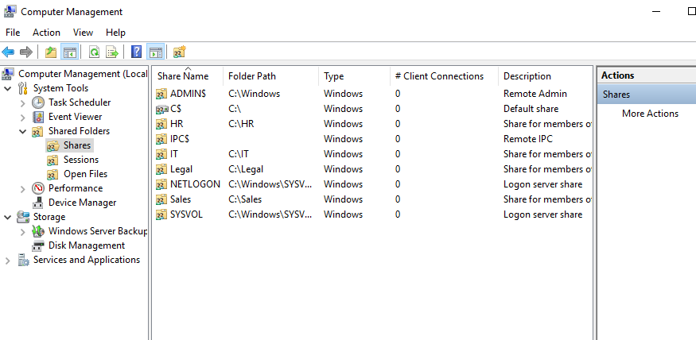

---
---

# Users and Permissions
Firstly, I created groups and Organizational Units to simulate different departments in an organization. I created an OU and group for every department. After creating the groups I wrote a simple powershell script to automate the creation of users. I created a file of 20 names for each OU and used random passwords from the rockyou database when creating the users. I modified the script for the different OU's/name lists. 

```powershell
#Declare username and password variables.
$usernames = Get-Content "C:\Users\Matt\Desktop\names4.txt"
$passwords = Get-Content "C:\Users\Matt\Desktop\passwords.txt"

# Ensure there are the same number of usernames and passwords
if ($usernames.Count -ne $passwords.Count) {
    Write-Error "The number of usernames and passwords does not match."
    exit
}

# Loop through usernames and assign a corresponding password
for ($i = 0; $i -lt $usernames.Count; $i++) {
    $u = $usernames[$i]
    $p = $passwords[$i]
    $pwd = ConvertTo-SecureString -String $p -AsPlainText -Force

    $first = $u.Split(" ")[0].ToLower()
    $last = $u.Split(" ")[1].ToLower()

    New-ADUser -Name "$first $last" -GivenName "$first" -Surname "$last" -SamAccountName "$first.$last" -Path "OU=IT, DC=MATT, DC=corp" -PasswordNeverExpires $true -AccountPassword $pwd -Enabled $true
}
```

After creating users and groups, I added some user access controls. I created group policy objects for every department and applied some restrictions to certain departments. For example, users in sales can not open command prompt, control panel, or powershell. 



When attempting to block PowerShell I learned that it is not as simple as disabling command prompt. I had to create a rule to the path where PowerShell is for both the x64 and x86 versions. Furthermore, I created separate rules to block PowerShell ISE. 


Below is a demonstration of the user access controls using a user named test user. Test User is a member of the Sales department.  







# SMB and more Permissions

After creating the users and groups, I made SMB shares for each department.

Each department share is restricted so that only members of that department and the domain admins can access the share

As shown in the images below, Test User who is a member of the Sales department, is able to access the Sales share, but not the Legal share.



